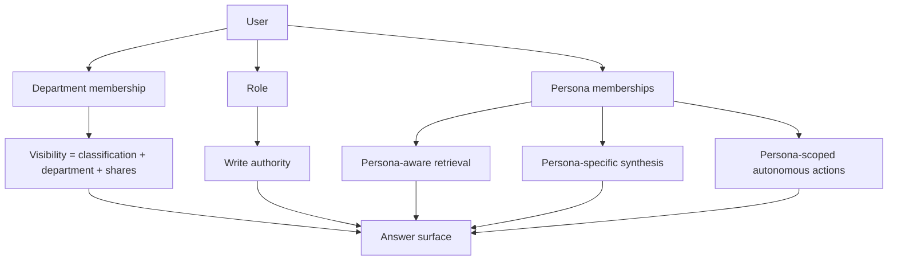

# ADR 0014 — Personas as a first-class organizing concept

> Status: **Accepted** · Date: 2026-04-30 · Deciders: Architect

## Context

The architecture as designed through ADR 0013 has three organizing
dimensions:

- **Department** — write scope and the natural visibility unit
  (per [ADR 0005](0005-rls-with-entra.md))
- **Role** — authority within a department: Reader, Contributor,
  Reviewer, Librarian, Admin (per [ADR 0005](0005-rls-with-entra.md))
- **Classification** — the access boundary on individual content:
  Public, Internal, Confidential, Restricted (per
  [ADR 0011](0011-data-classification.md))

These three dimensions answer *who can see what* and *who can write
what*. They do not answer a fourth question that turns out to matter
just as much: **what kind of work is this user doing right now?**

Different teams use the same corpus differently. An engineer
triaging a production incident wants code-grounded retrieval, similar
incident matches, and runbook attachments. A product manager
synthesizing a quarter's customer signals wants ticket clustering,
sentiment trends, and feasibility correlations against engineering
data. A sales rep prepping a meeting wants account history,
competitor mentions, and product-roadmap state. The questions overlap
the same sources but the *retrieval shape*, *synthesis style*, and
*appropriate autonomous actions* differ.

The existing department + role + classification model can't express
this. Department is about *what corpus you own*; role is about *what
authority you hold there*; classification is about *what's
sensitive*. None of them describe *the work-context the user is in
when they query the system*.

Without making this a first-class concept, two things go wrong:

1. **Retrieval and synthesis stay generic.** The system answers
   every persona's question the same way, even when the right answer
   shape differs materially.
2. **Autonomous actions can't be reasoned about coherently.**
   "Auto-classify a ticket" is appropriate when the user is doing
   Engineering triage; the same action makes no sense when the user
   is doing Sales prep. Without persona context, the action set
   becomes a flat list of capabilities rather than a curated set per
   work-context.

## Decision

### Personas as a fourth organizing dimension

A **persona** is a defined work-context. Each persona names:

- The kinds of inputs the user weights up
- The synthesis style appropriate to the work
- The autonomous internal actions the persona is permitted to invoke
  (per [ADR 0016](0016-persona-internal-autonomous-actions.md))
- The surfaces (dashboards, digests, MCP tool variants) the persona
  uses

Persona is **independent of department, role, and classification**.
A single user can have multiple personas; a department typically
needs multiple personas (Product PMs and Product Designers may share
a department but operate as different personas); one persona can span
departments (a "Product" persona exists in Engineering, Marketing,
and Customer Success teams).

**Persona is not visibility.** Visibility stays governed by
classification + department + source shares
(per [ADR 0005](0005-rls-with-entra.md),
[ADR 0011](0011-data-classification.md)). A user in the Engineering
persona who is *not* a member of the Finance department still cannot
read Finance's `Confidential` sources. Persona changes *what the
system does for you with what you can see*; it does not change what
you can see.

This separation is intentional and load-bearing — see ADR 0005's
amendment for the explicit policy guard.

### The four-dimension model



Each dimension answers a different question:

| Dimension | Answers |
|---|---|
| Department | What corpus do I own? |
| Role | What can I do *to* sources in that corpus? |
| Classification | What's safe for whom to see? |
| **Persona** | **What kind of work am I doing right now?** |

### Persona schema

```sql
CREATE TABLE personas (
	id                       uuid PRIMARY KEY DEFAULT gen_random_uuid(),
	name                     text NOT NULL UNIQUE,
	display_name             text NOT NULL,
	description              text NOT NULL,
	retrieval_profile        jsonb NOT NULL DEFAULT '{}',
	synthesis_style          jsonb NOT NULL DEFAULT '{}',
	default_action_set       jsonb NOT NULL DEFAULT '[]',
	classification_floor     text  NOT NULL DEFAULT 'Internal'
		CHECK (classification_floor IN ('Public','Internal','Confidential','Restricted')),
	deactivated_at           timestamptz,
	created_at               timestamptz NOT NULL DEFAULT now()
);

CREATE TABLE persona_memberships (
	user_id        uuid NOT NULL,
	persona_id     uuid NOT NULL REFERENCES personas(id),
	department_id  uuid REFERENCES departments(id),  -- optional scope
	granted_at     timestamptz NOT NULL DEFAULT now(),
	expires_at     timestamptz,                      -- optional
	granted_by     uuid NOT NULL,
	PRIMARY KEY (user_id, persona_id, department_id)
);

CREATE INDEX persona_memberships_user_idx
	ON persona_memberships (user_id);
```

`retrieval_profile` is a JSON blob describing how this persona
weights sources at retrieval time (see
[ADR 0015](0015-persona-aware-retrieval-synthesis.md)). Examples:
*"weight code chunks 1.5×, recent tickets 1.2×, code-comments 0.6×"*.
The shape is documented in ADR 0015; the field is JSON to allow the
shape to evolve without schema migration.

`synthesis_style` is a JSON blob describing the answer-shape
preferences (length, structure, citation density, code-quoting style).
Same flexibility rationale.

`default_action_set` is a JSON array of action-type identifiers the
persona is permitted to invoke autonomously (per
[ADR 0016](0016-persona-internal-autonomous-actions.md)). Empty array
= no autonomous actions for this persona.

`classification_floor` is the lowest classification this persona
ever sees in retrieval. A Marketing persona might floor at
`Internal` (don't surface `Confidential` HR content to Marketing
context even if the user happens to have access). This narrows
*retrieval*, not *visibility* — the user can still get to those
sources via other personas or direct retrieval, just not
automatically through this persona's surfaces.

### Persona membership rules

- A user may belong to **multiple personas simultaneously**. A senior
  engineer might be in `Engineering`, `Architecture-Review`, and
  `On-Call` personas. Each session designates a *primary persona*
  (per [ADR 0015](0015-persona-aware-retrieval-synthesis.md)).
- Memberships may be **department-scoped**. "Engineering persona,
  scoped to Backend" is different from "Engineering persona, scoped
  to Frontend." The optional `department_id` on `persona_memberships`
  expresses this.
- Memberships may be **time-bounded**. A short-term assignment to
  the `Incident-Response` persona expires after the incident.
- Memberships are **granted by Admin or by department Librarian** (a
  Librarian may add or remove memberships within their own
  department's scope; Admin may operate system-wide). This is
  documented as a write-authority extension to ADR 0005.

### v1 persona roster

The v1 roster is the set of personas defined for the program. Not
all are *implemented* in v1; most are *named* with brief definitions
so the schema and the roadmap have a known target. Engineering is
the v1 pilot persona (matching the v1 pilot department per Phase 1).

| Persona | Description | v1 status |
|---|---|---|
| **Engineering** | Code, tickets, runbooks, SRE conversations; triage and code-grounded answers | **Pilot in v1** |
| **Product** | Customer signal coalescence + Engineering feasibility data → feature decisions | Defined; full implementation in v2 |
| **SRE / Operations** | Logs, runbooks, post-mortems, on-call notes; incident-pattern detection | Defined; full implementation in v2/v3 |
| **Sales** | Customer conversations, win/loss, competitor intel, product wikis; account briefings | Defined; full implementation in v2/v3 |
| **Marketing** | Customer voice, win/loss analysis, competitor mentions, product changes | Defined; full implementation in v3 |
| **Customer Success** | Customer interactions scoped to specific accounts; at-risk flags, expansion signals | Defined; full implementation in v2/v3 |
| **Legal / Compliance** | Policies, contracts, prior decisions, regulatory updates | Defined; full implementation in v3+ |
| **HR / People** | Policies, anonymous feedback (strict classification), training-need analysis | Defined; full implementation in v3+ |

Each persona has its own brief in `docs/personas/` covering inputs,
outputs, autonomous actions, evaluation criteria, and pilot scope.

### Criteria for adding new personas

A new persona is added when **all** of the following are true:

1. There is a defined work-context not covered by existing personas
2. The retrieval, synthesis, or autonomous-action shape differs
   materially from what an existing persona provides
3. There is a sponsoring department willing to pilot it
4. The persona has a defined `default_action_set` — even if empty —
   so the autonomous-action surface is explicit from day one

Adding a persona is an Architect-approved change documented in
`docs/personas/<name>.md`; it does *not* require an ADR amendment.
Personas are intended to be a *living roster* that grows with the
organization, not a fixed taxonomy.

### Customer is not a persona

The customer is a **signal source**, not a system user. Customer
interactions (tickets, conversations, transcripts, surveys, in-app
feedback) feed the corpus through ingestion. Customers do not query
the AI Library. The carve-outs in
[ADR 0016](0016-persona-internal-autonomous-actions.md) ensure no
persona's autonomous actions affect customers directly.

## Consequences

### Easier

- **Retrieval and synthesis can be tuned per work-context** without
  forking the underlying retrieval pipeline. Per-persona weighting
  is a configuration concern, not a code-fork concern.
- **Autonomous actions become coherent.** Each persona has a defined
  action set; users see the system *help* their work, not a flat
  list of every possible automation.
- **Per-persona evaluation is now possible.** Different golden-set
  Q&A and quality criteria per persona, instead of one-size-fits-all
  evaluation.
- **The architectural model matches how the org actually works.**
  People do different kinds of work; the system now reflects that.
- **Adding a department is unaffected.** Persona is independent of
  department, so creating a new department doesn't require defining
  new personas for it.

### Harder

- **Four dimensions instead of three** — every architectural
  conversation now has to consider persona alongside department,
  role, and classification. Mitigation: documented widely
  (glossary, architecture, executive summary, this ADR).
- **Persona-aware retrieval is real engineering work.** ADR 0015
  defines the design; implementation lands in v2.
- **Per-persona evaluation frameworks multiply** the quality work.
  Mitigation: the spot-check linter (ADR 0007) and golden-set
  patterns are persona-templated, not persona-rewritten.
- **Persona membership management is a new operational surface.**
  Adding one more thing for Librarians to maintain. Mitigation:
  reasonable defaults (Engineering Librarian gets Engineering
  persona by default for their department's contributors); UI
  for bulk persona assignment.

### Risks

- **Persona-as-visibility creep.** The temptation to use persona to
  *restrict* what users see ("HR persona only sees HR sources") will
  recur. Mitigation: ADR 0005 amendment makes the separation
  explicit; reviewers gate any change that moves persona toward a
  visibility role.
- **Persona explosion.** If every team feels entitled to its own
  persona, the roster grows unbounded. Mitigation: explicit
  criteria (above) for adding new personas; quarterly persona
  review.
- **Confusion between persona and role.** Both are user-attached
  attributes; users may not distinguish them. Mitigation:
  glossary, naming conventions, UI surface that shows them as
  visibly different things (role badge vs. persona selector).
- **A user in the wrong persona for their work gets bad answers.**
  Mitigation: per-session persona selector at sign-in; later
  (v2+) persona auto-detection from query intent.
- **Persona-action drift.** A persona's `default_action_set`
  expands over time without review. Mitigation: actions in a
  persona's set are themselves ADR-scoped (ADR 0016); changes to
  the action set are auditable
  (per [ADR 0010](0010-audit-ledger.md) amendment).

## Alternatives considered

### Reuse role for what we're calling persona

Considered. Rejected because role is about *authority* (who can
write/approve/govern/delete), not about *work-context*. A Reviewer
persona doesn't make sense; a Reader-on-Sales-prep persona doesn't
either. Conflating them would muddle authorization with retrieval.

### Reuse department for persona

Considered. Rejected because departments are about *corpus
ownership*, not work-context. A user in the Engineering department
might be doing Product-style work today and triage work tomorrow;
their department doesn't change.

### Encode persona in MCP tool variants only (no DB schema)

Considered. Rejected because per-persona evaluation, audit, and
autonomous-action authority all require persistent persona context.
A purely-runtime persona concept can't be audited and can't be a
basis for action authority.

### Defer personas to v2

Considered. The lighter alternative was to ship the v1 AI Librarian
as designed (assisted-mode only, no persona awareness) and add
personas later. Rejected because the schema commitments, the
architecture diagrams, and the ADR cross-references are cheaper to
get right now than to retrofit. The implementation can stay scoped
(only Engineering persona is *wired* in v1); the *concept* lands in
the architecture today.

### Personas as a fully separate access-control system

Considered. Rejected as over-engineered. Personas don't grant or
deny access — that stays with classification + department + role.
Personas tune *what the system does for the user with the access
they already have*.

## References

- [ADR 0005](0005-rls-with-entra.md) — RLS with Entra (visibility model;
  amended in lockstep to clarify persona is not a visibility dimension)
- [ADR 0006](0006-llm-only-wiki-with-directives.md) — LLM-only wiki
  (page facets gain a persona dimension alongside classification)
- [ADR 0007](0007-claim-level-citation-contract.md) — Citation
  contract (persona context recorded with retrieval and synthesis
  events)
- [ADR 0010](0010-audit-ledger.md) — Audit ledger (persona-action
  event family added)
- [ADR 0011](0011-data-classification.md) — Data classification (the
  visibility model persona is *not*)
- [ADR 0015](0015-persona-aware-retrieval-synthesis.md) — How
  persona shapes retrieval and synthesis
- [ADR 0016](0016-persona-internal-autonomous-actions.md) — How
  persona scopes autonomous internal actions
- [`../personas.md`](../personas.md) — Top-level persona reference
- [`../decision-support-roadmap.md`](../decision-support-roadmap.md)
  — Phased rollout per persona
