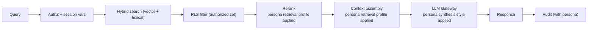

# ADR 0015 — Persona-aware retrieval and synthesis

> Status: **Accepted** · Date: 2026-04-30 · Deciders: Architect

## Context

[ADR 0014](0014-personas-first-class.md) introduces persona as a
fourth organizing dimension. This ADR defines *how* persona context
shapes the retrieval and synthesis pipelines without forking them.

Two design pressures shape the decision:

- **One pipeline, many personas.** Forking retrieval per persona
  multiplies operational and quality-assurance cost without
  proportional benefit. Persona should *parameterize* the existing
  pipeline, not replace it.
- **Persona must not change visibility.** Visibility stays governed
  by classification + department + source shares
  (per [ADR 0005](0005-rls-with-entra.md),
  [ADR 0011](0011-data-classification.md)). Persona-aware retrieval
  must demonstrably never widen *or narrow* what the user is
  authorized to read; it only changes ranking, presentation, and the
  shape of the synthesized answer over the same authorized result
  set.

The simplest workable shape is: persona contributes a
**retrieval profile** (source-type weights, recency curve,
authority-bias) and a **synthesis style** (answer shape, citation
density, code-quoting preferences) that the LLM Gateway
([ADR 0003](0003-llm-gateway-semantic-kernel.md)) and the retrieval
service apply on top of the user's authorized result set.

## Decision

### Retrieval pipeline summary (existing, unchanged)

The retrieval pipeline as designed:

1. The user submits a query through MCP `search` / `ask`
   ([ADR 0004](0004-mcp-as-single-access-layer.md)) or the portal
2. The API enforces auth, sets Postgres session variables
   (`app.user_id`, `app.is_employee`, `app.department_ids`,
   role lists, `app.is_admin`) per
   [ADR 0005](0005-rls-with-entra.md)
3. Retrieval performs a hybrid search: vector similarity (`pgvector`
   HNSW) + lexical (`tsvector`) over chunks
4. RLS at the database layer filters the result set to what the user
   is authorized to read (this is the load-bearing safety property)
5. A reranker scores the surviving candidates against the query
6. The top N chunks are passed to the LLM Gateway for synthesis
7. The Gateway produces a response, citation-grounded per
   [ADR 0007](0007-claim-level-citation-contract.md)
8. Audit captures the call and its outcome
   ([ADR 0010](0010-audit-ledger.md))

Persona inserts at steps 5, 6, and 7 only. Persona never affects
steps 2-4.

### Persona enters at three points



The three insertion points:

1. **Reranking** consults `persona.retrieval_profile` to weight
   candidates by source type, recency, and authority signals
2. **Context assembly** uses the same profile to choose which chunks
   make the final prompt and in what order
3. **Synthesis** uses `persona.synthesis_style` to shape the answer
   (length, structure, citation density, code-quoting style)

RLS filtering happens *before* reranking and is *unaffected by
persona*. This sequencing is the structural safety guarantee: a
persona cannot widen the authorized result set because RLS already
narrowed it.

### Retrieval-profile shape

The `persona.retrieval_profile` JSONB column has this shape (the
shape is documented here; the column is JSON to allow forward
evolution):

```jsonc
{
	"sourceTypeWeights": {
		"code":             1.5,
		"sql":              1.3,
		"runbook":          1.4,
		"ticket":           1.2,
		"meeting_transcript": 0.9,
		"wiki_page":        1.0,
		"email":            0.7,
		"image":            0.6
	},
	"recencyHalfLifeDays": 90,
	"authorityBias": {
		"canonical":     1.5,
		"current":       1.0,
		"superseded":    0.3,
		"draft":         0.5
	},
	"chunkOverlapStitching": "aggressive",
	"crossDepartmentBoost": {
		"sameDepartment": 1.2,
		"crossDepartmentInternal": 1.0,
		"crossDepartmentShared":   1.1
	},
	"floorClassification": "Internal"
}
```

Each field has a documented default; missing fields fall back to
the system default (effectively a neutral persona). All weights are
multiplicative against the baseline retrieval score; values near
1.0 mean "no opinion."

`floorClassification` here is informational — the structural floor
lives on `personas.classification_floor` per
[ADR 0014](0014-personas-first-class.md). The retrieval profile may
echo it for completeness; the column is the authority.

### Synthesis-style shape

The `persona.synthesis_style` JSONB column has this shape:

```jsonc
{
	"answerLengthHint":      "medium",   // short | medium | long
	"structurePreference":   "narrative", // narrative | bullet | tabular | code-first
	"citationDensity":       "per-claim", // per-claim | per-paragraph | minimal
	"codeQuoting":           "preserve-context", // preserve-context | minimal | inline
	"hedgingPosture":        "calibrated",  // calibrated | conservative | direct
	"abstentionThreshold":   0.7,
	"crossSourceSynthesis":  "always",  // always | when-needed | minimal
	"showSourceMetadata":    true
}
```

`abstentionThreshold` is the per-persona confidence floor below
which the system says "I don't have a clear answer for this in the
corpus" rather than hedging through a low-confidence response. This
threshold may be persona-specific — Engineering triage benefits
from "don't know" being said often; Sales prep tolerates more
calibrated hedging.

### Persona context as facet dimension

[ADR 0006](0006-llm-only-wiki-with-directives.md) (amended in
lockstep with this ADR) extends `page_facets` to include a persona
dimension alongside classification. A wiki page about
"Customer onboarding" may have:

- `Internal` × no-persona facet — the broadly-shared general view
- `Confidential` × no-persona facet — Sales-specific dollar
  thresholds
- `Internal` × Engineering facet — the same general view but
  re-shaped for engineering work (technical detail, integration
  surface, code references)
- `Internal` × Product facet — the same general view but re-shaped
  for product work (customer outcomes, market positioning,
  feasibility hooks)

Most pages have only the no-persona facet. Persona facets are
produced *only when* the source pool contains material that
substantively changes the right answer for that persona. The
Wiki Maintainer evaluates this at regeneration time; the criteria
are documented in ADR 0006's amendment.

Citations within a persona facet still respect the facet's
`min_classification` (per [ADR 0007](0007-claim-level-citation-contract.md)
rule 6).

### Session-time persona selection

A user with multiple persona memberships designates a *primary
persona* per session:

- **Web portal**: persona selector at sign-in; sticky for the session
- **MCP clients**: a `persona` parameter on the MCP `ask` and
  `search` tools; defaults to the user's most-used persona over the
  prior 30 days; if multiple are tied, defaults to the persona named
  in `Default-Persona` claim on the Entra token
- **Background agents**: persona is implicit in the agent's
  configuration (the Wiki Maintainer runs as a system persona; the
  Cascade-Regeneration Worker runs as a system persona)

Auto-detection from query intent is **not** in v1. It is captured
as a future enhancement (per
[`../future-enhancements.md`](../future-enhancements.md)). Explicit
selection is the v1 default because it gives the user a clear
mental model and gives evaluation a clear signal.

### When the user has no persona membership

A user without any persona membership uses the **default neutral
persona** — empty `retrieval_profile`, default `synthesis_style`,
no autonomous actions. This makes persona-membership-less operation
the system's lower-bound experience rather than a failure case.
A user querying through MCP without a persona claim gets the same
neutral experience.

### Cross-persona synthesis

When a query inherently spans personas (a Product question that
genuinely depends on Engineering signals, like
"how feasible is auto-tagging across the codebase?"), v1 does
**not** blend personas. Instead:

- The user's primary persona drives retrieval and synthesis
- The system surfaces *that retrieval was scoped to one persona* in
  the answer metadata
- The user can re-query with a different persona, or escalate to
  cross-persona synthesis (a v2+ capability — see
  [`../decision-support-roadmap.md`](../decision-support-roadmap.md))

Blending personas at retrieval time is conceptually clean but
operationally risky — the failure modes (a Product question that
cites engineering chunks reranked under Sales weights) are subtle
and hard to evaluate. Defer to v2+ where dedicated cross-persona
evaluation can validate it.

### Persona context in citations

Every retrieval and synthesis event records the persona under which
it happened (per [ADR 0007](0007-claim-level-citation-contract.md)
amendment). This enables:

- Per-persona evaluation: "How well does Engineering persona
  retrieve runbooks?" is a tractable query
- Drift detection: persona-specific quality regression shows up as
  per-persona metric drift
- Audit attribution: "what persona was the user in when this answer
  was produced?" is a one-query lookup

### Tuning retrieval profiles

In v1, retrieval profiles are **heuristic**: defaults proposed by
the Architect, refined by sponsoring persona stakeholders, edited
by hand. There is no automated tuning loop in v1.

In v2+, telemetry enables data-driven tuning: per-persona
click-through, per-persona thumbs-up/down on answers, per-persona
abstention-rate trends. The roadmap targets data-driven retuning
when a persona accumulates ≥1,000 evaluated queries.

## Consequences

### Easier

- **Persona is a configuration concern, not a code-fork concern.**
  New personas are a row in `personas` plus a brief; no code
  changes to the retrieval or synthesis pipelines.
- **Per-persona quality is measurable.** Citations carry persona
  context; evaluation can ask persona-specific questions.
- **Adding personas late is cheap.** v2 personas land by inserting
  rows; the architecture doesn't shift to accommodate them.
- **The retrieval pipeline stays singular.** One pipeline,
  parameterized — easier to operate, monitor, and harden.
- **Cross-persona synthesis can be deferred safely.** v1 picks one
  primary persona; the architecture is not committed to a blending
  strategy yet.

### Harder

- **Heuristic profiles in v1 will need real tuning.** The defaults
  the Architect proposes are educated guesses. Expect 2-3 rounds of
  refinement during the Engineering pilot before the profile feels
  right.
- **Persona-aware reranking is one more thing in the retrieval hot
  path.** Mitigation: the per-persona arithmetic is a small constant
  per candidate; the reranker is already sorting by score, so
  multiplying by persona weights is negligible.
- **Per-persona evaluation framework is real engineering.** Spot-
  check linter (per [ADR 0007](0007-claim-level-citation-contract.md))
  needs persona-aware variants. Phase 2 deliverable.
- **Cross-persona blending is a known v2+ open problem.** v1 ships
  with single-primary-persona retrieval; user education needs to
  cover this.

### Risks

- **A retrieval profile drifts from the persona's actual work**
  over time without anyone noticing. Mitigation: per-persona
  quality metrics in the Phase 4 dashboard; quarterly persona
  review covers profile drift.
- **The "no autonomous tuning" stance is undisciplined.** Without
  data-driven tuning, profiles get adjusted on hunches.
  Mitigation: the v2+ tuning framework with telemetry threshold
  is documented; until then, profile changes require a written
  rationale in the persona brief.
- **Persona facets multiply wiki regeneration cost.** A page with
  3 classification tiers × 4 personas = 12 facets, all needing
  Maintainer passes. Mitigation: ADR 0006's amendment requires
  facets only when the source pool *substantively* changes the
  answer; most pages have far fewer than 12 facets in practice.
- **A query goes to the wrong primary persona** (the user is in
  Sales prep persona but is actually doing Engineering triage in
  this moment). Mitigation: per-session persona selector is
  prominent; persona auto-detection arrives in v2+.
- **Persona-aware reranking masks an underlying retrieval-quality
  regression.** Persona weights can paper over a degraded
  underlying retrieval. Mitigation: the per-persona evaluation
  framework includes a *neutral-persona* baseline so persona-
  specific gains are measured against the baseline.

## Alternatives considered

### Per-persona retrieval pipelines (forked)

Considered. Rejected because it multiplies operational cost,
fragments evaluation, and makes adding personas expensive. One
pipeline parameterized by persona is the better trade.

### Persona-as-prompt-only

Considered: persona could just be a string the synthesis prompt
incorporates. Rejected because it leaves retrieval untuned and
loses the per-persona evaluation, audit, and action-authority
benefits of a persisted persona model.

### Cross-persona blending in v1

Considered. Rejected as a v1 over-reach — the failure modes are
subtle and our evaluation framework isn't yet persona-aware enough
to catch them. Punted to v2+ with explicit roadmap entry.

### Auto-detect persona from query intent

Considered for v1. Rejected because:
- It hides the persona from the user (worse mental model)
- It's hard to evaluate (you can't measure persona-detection
  quality without ground truth, which doesn't exist yet)
- It creates a category of failure we can't easily diagnose
  ("system picked wrong persona, gave bad answer")

Captured in `future-enhancements.md` as a v2+ candidate once enough
labeled per-persona data exists to train and evaluate detection.

### Heavier persona-as-LoRA / per-persona model fine-tuning

Considered. Rejected for v1 — too speculative, too expensive,
provider-specific. Persona-shaped prompting + tuned retrieval
cover the value at far lower cost. May reconsider after v2 if
data-driven tuning hits a quality ceiling.

## References

- [ADR 0003](0003-llm-gateway-semantic-kernel.md) — LLM Gateway
  (the layer that applies persona synthesis style)
- [ADR 0004](0004-mcp-as-single-access-layer.md) — MCP (the entry
  point that carries the persona parameter)
- [ADR 0005](0005-rls-with-entra.md) — RLS (the load-bearing
  authorization layer that runs *before* persona-aware reranking)
- [ADR 0006](0006-llm-only-wiki-with-directives.md) — LLM-only wiki
  (page facets gain a persona dimension)
- [ADR 0007](0007-claim-level-citation-contract.md) — Citation
  contract (records persona context with every retrieval and
  synthesis event)
- [ADR 0011](0011-data-classification.md) — Data classification
  (the visibility model persona is *not*)
- [ADR 0014](0014-personas-first-class.md) — Personas as a
  first-class organizing concept
- [ADR 0016](0016-persona-internal-autonomous-actions.md) — How
  persona scopes autonomous internal actions
