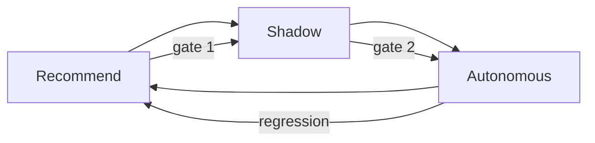

# ADR 0016 — Internal autonomous actions, scoped per persona

> Status: **Accepted** · Date: 2026-04-30 · Deciders: Architect

## Context

[ADR 0014](0014-personas-first-class.md) makes persona a fourth
organizing dimension. [ADR 0015](0015-persona-aware-retrieval-synthesis.md)
defines how persona shapes retrieval and synthesis. This ADR defines
**what autonomous actions a persona may take**, the strict
operational and ethical guardrails on those actions, and the
progression model from human-recommend through shadow to autonomous
execution.

The user's intent for the AI Library is **decision support**, not
autonomous customer-facing decisioning. Two scope statements anchor
this ADR:

1. **Decisions are about helping internal teams** — feature
   prioritization, ticket triage, account-risk surfacing, content
   tagging, draft generation. Not about taking direct action toward
   customers, and not about making binding monetary decisions on
   behalf of the company.
2. **The customer is a signal source, not a system user**
   ([ADR 0014](0014-personas-first-class.md)). No autonomous action
   may emit communication to a customer or alter a customer-facing
   system state.

These intents collapse into two **permanent carve-outs** that this
ADR makes structural, not phase-deferred.

## Decision

### Capability scope

Internal autonomous actions are limited to actions **the system
takes inside the AI Library or the business's internal tooling**
that affect *internal users*, *internal queues*, or *internal
records of work*. Examples that fall in scope:

- Classify a ticket against a known taxonomy
- Route a ticket to the right team / persona / queue
- Prioritize an item in an internal backlog
- Tag a document, conversation, or transcript
- Cluster signals (similar tickets, recurring complaints)
- Draft a proposed response, brief, or summary into a queue for a
  human to review
- Flag at-risk accounts or anomalous patterns to internal owners
- Attach related runbooks, prior incidents, or canonical docs
- Schedule an internal follow-up reminder

Examples that fall out of scope and are addressed by the carve-outs
below:

- Send an email or in-app message to a customer
- Change a customer's account status, subscription, or entitlements
- Approve, deny, or execute a refund, credit, or charge
- Sign a contract, accept terms, or commit the company
- Terminate an account, ban a user, or alter access externally

### Permanent carve-outs

#### Carve-out 1: No autonomous customer-facing actions

The AI Library may not autonomously emit any communication to a
customer (email, SMS, in-app message, ticket reply, social-channel
reply, voice call, push notification) or change any customer-facing
system state (account status, subscription, billing, entitlements,
access). Drafts that are *intended* for customer audiences are
allowed only as drafts placed in an internal queue for explicit
human review; the human user (not the AI) effects the send.

This is permanent. It is not a phase-deferral. Any future request
to enable an autonomous customer-facing action requires:

1. A new ADR (not an amendment) explicitly justifying the change
2. Legal sign-off
3. The new ADR superseding this carve-out *narrowly* (one action
   at a time, never a blanket lift)

The default position is structural — the persona action set may
reference draft-generation actions, but the resulting drafts
**always** route to an internal-only queue.

#### Carve-out 2: No AI-direct money / refund decisions

The AI Library does not autonomously approve, deny, or execute any
decision that moves money or alters refund / credit / charge state.
This includes:

- Approving or denying refund requests
- Issuing credits or adjustments
- Initiating chargebacks or charge reversals
- Modifying invoices, billing terms, or pricing

The AI may **recommend, analyze, draft, surface signals, summarize
prior decisions, suggest precedent, and identify risk patterns**
on money/refund-adjacent work. A human always makes the binding
call. The output of any AI work on money/refund matters lands in a
human queue or recommendation surface — never in a system that
effects a money movement.

This is permanent. It is not a phase-deferral. Recommend / analyze
/ draft modes for money/refund-adjacent work remain available; the
constraint is on the *binding decision* and the *execution path*.

#### Why permanent carve-outs?

The user's stated intent is decision support, not autonomous
decisioning on customer-affecting outcomes. Encoding the carve-outs
in the architecture (rather than as policy) keeps them durable
across future implementations, future model upgrades, and future
team turnover. Any reversal requires a deliberate, audited change.

### Modes of action

Each autonomous action runs in one of four modes:

| Mode | Behavior | Audit |
|---|---|---|
| **Recommend** | The system surfaces a suggestion for a human; the human chooses | Recommendation logged with persona, action type, target, confidence |
| **Shadow** | The system *simulates* an autonomous decision and logs what it *would have* done; no real-world effect | Shadow decision logged with persona, action type, target, simulated outcome, what a human actually did |
| **Autonomous** | The system effects the action; humans review samples and outcomes after the fact | Action and reversal path logged; periodic sample review |
| **Off** | Action is disabled for this persona | n/a |

A persona's `default_action_set` lists each action with its current
mode (per [ADR 0014](0014-personas-first-class.md)). All actions
default to **Recommend** when first added; promotion to Shadow and
then Autonomous follows the gating below.

### Progressive autonomy gating

An action progresses Recommend → Shadow → Autonomous only when
explicit, measurable gates are met:



| Transition | Required evidence |
|---|---|
| Recommend → Shadow | ≥30 days in Recommend mode for this persona; ≥200 evaluated recommendations; agreement-with-human ≥85% on a held-out review sample |
| Shadow → Autonomous | ≥30 days in Shadow mode; ≥500 shadow decisions; agreement-with-human-override ≥90%; reversal-path tested in staging; Sponsoring Persona Owner sign-off |
| Autonomous → Recommend (regression) | Any of: agreement drops below 85% over a 7-day window; a documented incident attributable to the action; persona owner request |

These thresholds are starting values for v1+v2; adjusted in the
roadmap as evidence accumulates.

The Sponsoring Persona Owner is named in the persona brief
(`docs/personas/<name>.md`); they are the human accountable for
the persona's action set.

### Reversibility-by-design

Every action with a non-Recommend mode must have a documented
**reversal path**:

- **Re-classify**: classification can be changed back; reversal is
  trivial (one column update + audit event)
- **Re-route**: ticket can be re-routed; reversal is the prior
  routing assignment + audit event
- **Re-prioritize**: prior priority is restored from audit
- **Tag remove**: tag is removed; underlying source unchanged
- **Cluster un-merge**: clusters are derived; un-merging
  recomputes from the source data

Actions whose effects are not cleanly reversible are **not
candidates for Autonomous mode** under this ADR. They may run in
Recommend or Shadow indefinitely.

### Action-record schema

Every autonomous-mode (or shadow-mode) decision creates an
action-record row:

```sql
CREATE TABLE persona_action_records (
	id              uuid        PRIMARY KEY DEFAULT gen_random_uuid(),
	occurred_at     timestamptz NOT NULL DEFAULT now(),
	persona_id      uuid        NOT NULL REFERENCES personas(id),
	actor_user_id   uuid        NOT NULL,            -- 'system' for autonomous
	action_type     text        NOT NULL,            -- e.g. 'ticket.classify'
	mode            text        NOT NULL CHECK (mode IN ('recommend','shadow','autonomous')),
	target_kind     text        NOT NULL,
	target_id       uuid        NOT NULL,
	proposed_value  jsonb       NOT NULL,
	prior_value     jsonb,
	confidence      numeric(3,2) NOT NULL CHECK (confidence BETWEEN 0 AND 1),
	correlation_id  uuid        NOT NULL,
	committed       bool        NOT NULL DEFAULT false,
	reversed_at     timestamptz,
	reversed_by     uuid,
	reversal_reason text
);

CREATE INDEX persona_action_records_target_idx
	ON persona_action_records (target_kind, target_id);

CREATE INDEX persona_action_records_persona_action_idx
	ON persona_action_records (persona_id, action_type, occurred_at);
```

Outcomes are tracked separately (a human's eventual override, a
correctness verdict, a downstream signal) so the action and its
evaluation are not coupled at write time:

```sql
CREATE TABLE persona_action_outcomes (
	action_id       uuid        NOT NULL REFERENCES persona_action_records(id),
	occurred_at     timestamptz NOT NULL DEFAULT now(),
	outcome_kind    text        NOT NULL,    -- 'human_override' | 'correct' | 'incorrect' | 'no_signal'
	outcome_value   jsonb,
	recorded_by     uuid        NOT NULL,
	PRIMARY KEY (action_id, occurred_at)
);
```

Both tables are RLS-bound to the same visibility predicates as their
target rows — a Persona Action Record on a Confidential ticket is
itself Confidential.

### Per-action authority

An action `T` on a target with classification `C` requires the user
*originating the action* (or the persona, for autonomous) to have
read-and-write access to that target. This is enforced by:

1. RLS on the target table (per
   [ADR 0005](0005-rls-with-entra.md))
2. The persona's `default_action_set` listing `T` in a non-Off mode
3. The persona membership being non-expired and active
4. (For autonomous) the action being in Autonomous mode for this
   persona

An autonomous action by a system identity uses the **originating
persona membership of the most recent human user in the chain**
(per ADR 0010's `originated_by` field). System-only autonomous
actions with no human originator are reserved for the Wiki
Maintainer / Cascade-Regeneration Worker scope and do not invoke
persona-action records.

### What's in the action-record audit family

The audit ledger ([ADR 0010](0010-audit-ledger.md), amended in
lockstep) gains a new event family:

- `persona_action.proposed` — Recommend-mode suggestion surfaced
- `persona_action.shadowed` — Shadow-mode decision logged
- `persona_action.committed` — Autonomous-mode action effected
- `persona_action.reversed` — A committed action was reversed
- `persona_action.outcome_recorded` — A `persona_action_outcomes`
  row was created
- `persona_membership.granted` — A persona membership added
- `persona_membership.revoked` — A persona membership removed
- `persona_action.mode_changed` — An action's mode for a persona
  changed (Recommend → Shadow, Shadow → Autonomous, regression
  back to Recommend)

### Per-persona action-set definition lives in the persona brief

This ADR defines the *capability framework*. The *action set* per
persona (which actions, in which mode, with what thresholds) lives
in the persona's brief in `docs/personas/<name>.md`. The brief is
the contract between the architecture and the sponsoring persona
owner.

The Engineering persona is the v1 pilot; its initial action set
appears in [`../personas/engineering.md`](../personas/engineering.md).
Other personas land their action sets in v2+.

### Mandatory human-in-the-loop

Even in Autonomous mode, **periodic human review is mandatory**:

- Sample at least 5% of autonomous decisions per persona per week
  for human verification
- Surface a "queue of recent autonomous actions" view in the
  reviewer dashboard
- An action with a downstream human override automatically becomes
  a candidate for the agreement metric

If sampling lapses for >14 days for a persona, the autonomous
actions for that persona automatically regress to Shadow mode (a
sentinel job enforces this). The regression itself is an audited
event.

## Consequences

### Easier

- **The decision-support framing is structural, not aspirational.**
  The carve-outs cannot be lifted by a runtime config flag; they
  require deliberate ADR-level changes.
- **Each action has a defined progression.** No action goes from
  "designed" to "fully autonomous" in one step; the gate model
  forces evidence accumulation.
- **Reversal is always available.** Reversibility-by-design means
  an autonomous action gone wrong is a one-row update plus an
  audit event, not a multi-system rollback.
- **Per-persona evaluation of action quality is straightforward.**
  Action-record + outcome rows give a clean dataset.

### Harder

- **Operational discipline is required to maintain mandatory
  sampling.** The 5%-per-week threshold is real work; mitigation
  via the auto-regression sentinel.
- **Carve-out drift will be tested.** Some product idea ("just
  let the AI auto-send the polite acknowledgment...") will press
  on the customer-facing carve-out. Mitigation: the documented
  procedure for change is high-friction by design.
- **Action sets per persona are individual artifacts.** Each
  persona's brief carries the contract, which means N persona
  briefs to maintain. Mitigation: a template; the briefs are
  short.
- **The Recommend → Shadow → Autonomous progression is slow.**
  An action takes ≥60 days minimum to reach Autonomous. This is
  a feature, not a bug — but stakeholders may push for shortcuts.
  Mitigation: the gate thresholds are recorded here and require
  ADR-level changes to relax.

### Risks

- **A persona's action set grows quietly over time** without the
  rigor of an ADR. Mitigation: changes to action sets are
  audited (`persona_action.mode_changed`); persona briefs are
  reviewed quarterly.
- **An autonomous action causes harm before the agreement metric
  catches it.** Mitigation: reversibility-by-design; the
  Sponsoring Persona Owner is named and accountable; sampling
  ensures fast detection.
- **The "no autonomous customer-facing" carve-out has a soft
  edge.** A draft response to a *prospect* is technically
  customer-adjacent; a tag applied to a customer record is
  sometimes considered customer-facing in some operational
  models. Mitigation: the carve-out is explicitly *emit
  communication or alter customer-facing state*; ambiguous cases
  go to a human queue, never autonomous.
- **Sampling fatigue.** 5% review per week feels like a lot when
  volume is high. Mitigation: sampling can be UI-supported with
  a "thumbs up / thumbs down" affordance; mandatory threshold can
  be adjusted in the persona brief but not below 1%.
- **Reversibility is sometimes nominal but operationally
  expensive** (re-routing 1,000 tickets is technically reversible
  but disruptive). Mitigation: the persona owner reviews the
  reversal-path realism before the Recommend → Shadow promotion.

## Alternatives considered

### A single global action authority (not per-persona)

Considered. Rejected because different personas have different
appropriate action sets — Engineering's auto-classify is
appropriate for engineering tickets and inappropriate for legal
clauses. Per-persona scoping matches the work-context; a global
authority would be a poor fit.

### Direct-to-Autonomous, with human review only on flagged outliers

Considered. Rejected because we don't have a calibrated outlier-
detector before the action runs in Recommend mode. Recommend →
Shadow → Autonomous accumulates the data needed to know what
"outlier" means.

### No carve-outs; trust the autonomy gate to constrain customer-
facing actions

Considered. Rejected because the carve-outs encode user intent at
an architectural level. Relying on the gate alone leaves the door
open to incremental drift; structural carve-outs are durable.

### AI-direct money / refund decisions in Autonomous mode for
small-value refunds

Considered. Rejected explicitly per user direction. AI may
analyze, recommend, and draft for money/refund-adjacent work, but
not effect binding decisions on money. This is a *permanent*
constraint, not a phase-deferral.

### Per-action-type ADRs

Considered. Rejected as too heavyweight; a single framework ADR
covers all internal autonomous actions, with per-persona briefs
defining the per-persona action set. New action *categories*
(e.g., scheduling, notifying-internal) may warrant amendments; new
*instances* within a category do not.

## References

- [ADR 0005](0005-rls-with-entra.md) — RLS (the load-bearing
  authorization layer for action targets)
- [ADR 0007](0007-claim-level-citation-contract.md) — Citation
  contract (autonomous actions extend the citation contract to
  action drafts)
- [ADR 0010](0010-audit-ledger.md) — Audit ledger (gains the
  persona-action event family)
- [ADR 0011](0011-data-classification.md) — Classification
  (action-record visibility follows target classification)
- [ADR 0014](0014-personas-first-class.md) — Personas as a
  first-class organizing concept
- [ADR 0015](0015-persona-aware-retrieval-synthesis.md) —
  Persona-aware retrieval and synthesis
- [`../personas.md`](../personas.md) — Persona index
- [`../personas/engineering.md`](../personas/engineering.md) — v1
  pilot persona's action set
- [`../decision-support-roadmap.md`](../decision-support-roadmap.md)
  — Roadmap for action progression per persona
- [`../future-enhancements.md`](../future-enhancements.md) —
  Deliberately-deferred capabilities (with the carve-outs noted as
  permanent)
