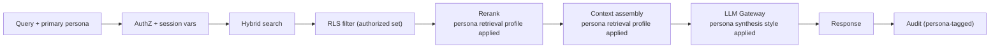

# AI Librarian — Architecture

> Status: **Draft for review** · Last updated: 2026-04-29
>
> This document is the source of truth for the AI Librarian architecture.
> Each significant choice is captured in an ADR under [`adr/`](adr/) and
> linked inline.

## Goals

1. **One enterprise knowledge platform.** Every department curates its own
   corpus and gets its own LLM-maintained wiki, but they all live on one
   system, with one identity model, one access layer, one audit trail.
2. **Any AI client, one entry point.** Cursor, Copilot, Claude Desktop,
   ChatGPT Enterprise, Teams, the web portal — all of them call the same
   Model Context Protocol (MCP) server. There is no second API surface.
3. **Verifiable, traceable answers.** Every claim the LLM produces cites a
   real source by ID and span anchor. No confabulation survives the
   citation validator. (See [ADR 0007](adr/0007-claim-level-citation-contract.md).)
4. **Classification-driven access, role-based authority.**
   Departments are flat. Each `(department, role)` tuple maps to a
   Microsoft Entra ID group. **Read access** is gated by source
   classification (`Internal` content is readable across the
   company; `Confidential` and `Restricted` content stays
   department-scoped, with explicit `source_shares` for
   exceptions). **Write authority** (submit, review, govern,
   delete) is gated strictly by department + role. RLS in
   Postgres enforces both. (See
   [ADR 0005](adr/0005-rls-with-entra.md) and
   [ADR 0011](adr/0011-data-classification.md).)
5. **Enterprise-grade audit and deletion.** Append-only audit ledger,
   tiered deletion (soft / hard / quarantine), right-to-be-forgotten that
   cascades through the wiki without breaking SOX-style retention of
   audit metadata. (See [ADR 0008](adr/0008-tiered-deletion-and-rtbf.md)
   and [ADR 0010](adr/0010-audit-ledger.md).)
6. **LLM-agnostic, but enterprise-tier only.** No vendor lock-in at
   the model layer. Every LLM call goes through one gateway that can
   hot-swap providers (Azure OpenAI, OpenAI, Anthropic, Bedrock,
   Ollama, vLLM) by config. **Every configured provider is expected
   to be on an enterprise-tier agreement** with documented
   data-handling commitments (no training, bounded retention, no
   human review without consent, tenant-bound data). The same
   expectation applies to AI clients accessing via MCP. (See
   [ADR 0003](adr/0003-llm-gateway-semantic-kernel.md) and
   [ADR 0012](adr/0012-enterprise-tier-llm-access.md).)
7. **Multimodal day-1.** Text, code, SQL, PDFs, Office docs, images,
   audio, video — all ingestable, all citable, all retrievable.
8. **Persona-driven decision support.** The system is organized
   around four dimensions, not three: department, role,
   classification, and **persona**. A persona is a defined work-
   context (Engineering triage, Product synthesis, SRE incident
   response, Sales prep, etc.) that tunes retrieval, synthesis,
   and the set of internal autonomous actions a user may invoke.
   Persona is *not* a visibility dimension — visibility stays
   governed by classification + department + source shares. The v1
   pilot wires the Engineering persona end-to-end. (See
   [ADR 0014](adr/0014-personas-first-class.md),
   [ADR 0015](adr/0015-persona-aware-retrieval-synthesis.md),
   [ADR 0016](adr/0016-persona-internal-autonomous-actions.md).)

## Non-goals (v1)

- Real-time collaboration on wiki pages (the wiki is LLM-authored, see
  [ADR 0006](adr/0006-llm-only-wiki-with-directives.md))
- Cross-tenant federation
- **On-prem, air-gapped, or customer-datacenter operation**
  (permanently out of scope, not a v1 deferral; see
  [ADR 0013](adr/0013-hyperscaler-deployment-scope.md))
- Multi-cloud active-active operation (the architecture is
  *portable* between Azure and AWS but a given deployment runs
  on one hyperscaler)
- Mobile-native clients (web + Teams covers v1)
- **Autonomous customer-facing actions** of any kind — no
  autonomous email send, no autonomous account-status change, no
  autonomous service-eligibility decision (permanently out of
  scope; see
  [ADR 0016](adr/0016-persona-internal-autonomous-actions.md))
- **AI-direct money / refund decisions** — the AI may analyze,
  recommend, draft, and surface signals on money/refund-adjacent
  work, but a human always makes the binding call (permanently
  out of scope; see
  [ADR 0016](adr/0016-persona-internal-autonomous-actions.md))
- Cross-persona synthesis in v1 (deferred to v4; v1-v3 use
  single-primary-persona retrieval)

## High-level architecture

```
┌─────────────────────────────────────────────────────────────────────────┐
│  Capture surfaces                                                       │
│  ── Web portal (Blazor)  ── Teams bot  ── REST API  ── CLI              │
│  ── Email drop  ── SharePoint connector  ── Git repo watcher            │
└──────────────────────────────────┬──────────────────────────────────────┘
                                   │  Entra ID (OIDC) ── group claims
                                   ▼
┌─────────────────────────────────────────────────────────────────────────┐
│  Ingestion API (ASP.NET Core)                                           │
│   AuthZ ── DLP/PII scan ── virus scan ── enqueue                        │
└──────────────────────────────────┬──────────────────────────────────────┘
                                   ▼  Azure Service Bus
┌─────────────────────────────────────────────────────────────────────────┐
│  Ingestion Workers (Container Apps Jobs, .NET hosts)                    │
│   Format → Skill plugin (PDF/DOCX/SQL/code/video/image)                 │
│   Canonicalize to markdown + metadata                                   │
│   SHA-256 fingerprint → dedup                                           │
│   Editorial filter (per-dept policy, LLM-scored)                        │
│   Chunk → embed (via LLM Gateway)                                       │
│   Persist → submit to approval queue (per-dept rules)                   │
└────────┬────────────────┬──────────────────┬───────────────────────────┘
         ▼                ▼                  ▼
┌──────────────┐  ┌────────────────┐  ┌──────────────────────┐
│ Azure Blob   │  │ Postgres       │  │ Postgres             │
│ (raw, WORM,  │  │ Flexible       │  │ Flexible             │
│  immutable,  │  │ + pgvector     │  │ (wiki tables,        │
│  lifecycle)  │  │ (chunks,       │  │  claims,             │
│              │  │  embeddings,   │  │  citations,          │
│              │  │  RLS)          │  │  revisions)          │
└──────┬───────┘  └────────┬───────┘  └──────────┬───────────┘
       └────────────────┬─┴─────────────────────┘
                        ▼
┌─────────────────────────────────────────────────────────────────────────┐
│  LLM Gateway (.NET, Semantic Kernel)                                    │
│   IChat · IEmbedding · IRerank ── provider-agnostic                     │
│   Per-call telemetry → audit ledger                                     │
└──────────────────────────────────┬──────────────────────────────────────┘
                                   ▼
┌─────────────────────────────────────────────────────────────────────────┐
│  Librarian Agents (Container Apps, background services)                 │
│   Wiki Maintainer · Linter · Approval-Queue Assistant                   │
│   Cascade-Regeneration Worker (RTBF flows)                              │
└──────────────────────────────────┬──────────────────────────────────────┘
                                   ▼
┌─────────────────────────────────────────────────────────────────────────┐
│  MCP Server (.NET, ModelContextProtocol C# SDK)                         │
│   Tools: search · get_page · get_neighborhood · ask · cite ·            │
│           list_departments · list_recent_changes                        │
│   Auth: Entra bearer → RLS context pushdown                             │
└──────────────────────────────────┬──────────────────────────────────────┘
                                   ▼
   Cursor · Copilot · Claude Desktop · Teams · ChatGPT Enterprise · Web

┌─────────────────────────────────────────────────────────────────────────┐
│  Cross-cutting                                                          │
│  Audit ledger (append-only, partitioned) · App Insights · Azure Monitor │
│  Key Vault · Defender for Cloud · Microsoft Sentinel (SIEM export)      │
└─────────────────────────────────────────────────────────────────────────┘
```

## The three layers (Karpathy's pattern, formalized)

We adopt Karpathy's three-layer model and make each layer enterprise-grade.

### Layer 1 — Raw sources (immutable)

The bytes that come in, exactly as submitted. Stored in Azure Blob with
WORM (immutability) policies and lifecycle rules for retention. Each blob
is content-addressed by SHA-256. Sources are *never* modified after
ingest. They can only be soft-deleted, hard-deleted, or quarantined (see
[ADR 0008](adr/0008-tiered-deletion-and-rtbf.md)).

**Shape**:

- One `sources` row per submission, holding metadata (department,
  uploader, timestamp, SHA-256, MIME type, classification, retention
  policy, status: `pending`, `approved`, `rejected`, `quarantined`,
  `deleted`).
- Many `chunks` rows derived from the source by the ingestion pipeline.
- Many `embeddings` rows, one per chunk, in `pgvector`.

### Layer 2 — The wiki (LLM-authored, compounding)

Markdown content stored in Postgres tables, written exclusively by the
Wiki Maintainer agent. The wiki is the *synthesis* layer — what the
company knows, organized for retrieval. Humans never edit wiki content
directly; they govern it through four indirect levers:

1. **Sources** — what gets ingested
2. **Department policies** — editorial rules (in-scope, out-of-scope,
   quality threshold, classification) ([ADR 0006](adr/0006-llm-only-wiki-with-directives.md))
3. **Directives** — persistent content-level guidance the maintainer
   must obey
4. **Page locks** — pages that require librarian approval before any
   regeneration is applied

A wiki page is a **topic + slug** with one or more **facets** —
content variants per visibility tier ([ADR 0006](adr/0006-llm-only-wiki-with-directives.md),
[ADR 0011](adr/0011-data-classification.md)). The Maintainer
produces a facet per classification level when source material
supports it. Cross-department readers receive the highest-
classification facet they can access — typically the `Internal`
facet, which is synthesized exclusively from `Internal` sources and
contains no leakage path from `Confidential` material.

Every wiki *claim* references a `source_id` plus a span anchor (page,
paragraph, timestamp, etc.). This is the contract from
[ADR 0007](adr/0007-claim-level-citation-contract.md) — without it,
right-to-be-forgotten cascades and verifiable answers are both
impossible. Citations within a facet only reference sources visible at
that facet's classification level.

### Layer 3 — The schema (governance configuration)

This is the configuration that tells the wiki maintainer agents how to
behave. It lives in two places:

1. **Per-department** — `department_policies` and
   `department_directives` tables, edited through the librarian portal.
2. **System-wide** — versioned schema documents in the `docs/` folder
   (`AGENTS.md`, page format conventions, citation rules, lint rules).
   These ship with the system and are read by the maintainer agents on
   startup.

The schema is what makes the LLM a disciplined wiki maintainer rather
than a generic chatbot. We co-evolve it as we learn what works.

## Data model

This is a high-level entity sketch; the full DDL lives in
`db/changelog/` (Liquibase, per project conventions) once Phase 0 starts.

| Entity | Purpose |
|---|---|
| `departments` | Flat. Each (department, role) tuple maps to one Entra group. |
| `users` | Cached identity from Entra; primary key matches `oid` claim. |
| `roles` | `Reader`, `Contributor`, `Reviewer`, `Librarian`, `Admin`, granted per department (Admin is system-wide). |
| `sources` | One row per submitted source, with status, classification (`Public` / `Internal` / `Confidential` / `Restricted` per [ADR 0011](adr/0011-data-classification.md)), retention. Classification is the default access boundary. |
| `source_shares` | Explicit cross-department read grants for individual `Confidential` or `Restricted` sources; granted by Librarian (or Admin for `Restricted`); auditable, revocable, optionally time-bounded. |
| `chunks` | Canonicalized markdown chunks derived from sources, with span anchors. |
| `embeddings` | Vector per chunk, `pgvector` HNSW indexed. |
| `wiki_pages` | Logical wiki page identifier and slug; locked flag; one row per topic. |
| `page_facets` | One row per `(page, min_classification)` tuple. Each facet has its own body and revision history. The Maintainer produces facets per visibility tier so cross-department readers see the broad-readable version while department members see the full-detail version. |
| `wiki_page_revisions` | Append-only revisions per facet; current is a view. |
| `wiki_claims` | Atomic factual statements within a facet; immutable rows. Citation visibility is scoped to the facet's `min_classification`. |
| `wiki_claim_citations` | M:N from `wiki_claims` to `chunks` with span info. |
| `department_policies` | Per-dept editorial policy (versioned). |
| `department_directives` | Per-dept content directives (versioned). |
| `approval_queue` | Items awaiting librarian decision. |
| `audit_events` | Append-only, partitioned by month, the SOC2-grade ledger. |
| `personas` | One row per defined persona with `retrieval_profile`, `synthesis_style`, `default_action_set`, and `classification_floor`. The fourth organizing dimension per [ADR 0014](adr/0014-personas-first-class.md). |
| `persona_memberships` | M:N from `users` to `personas`, optionally department-scoped, optionally time-bounded. A user designates a primary persona per session. |
| `persona_action_records` | One row per Recommend / Shadow / Autonomous action proposed or committed; carries proposed/prior values, confidence, correlation, and reversal metadata. RLS-bound to the target row's visibility. |
| `persona_action_outcomes` | Outcomes of `persona_action_records` (human override, correctness verdict, downstream signal). Decoupled from action-write time so evaluation is not blocking. |

## Identity, authorization, and tenancy

See [ADR 0005](adr/0005-rls-with-entra.md) and
[ADR 0011](adr/0011-data-classification.md) for the full model.
Summary:

- All users authenticate via **Microsoft Entra ID** (OIDC).
- Departments are **flat**. There is no parent/child hierarchy.
- Each `(department, role)` tuple maps to exactly one Entra group
  (e.g., `AILIB-Engineering-Librarian`, `AILIB-Finance-Reader`).
- A user's effective access is the union of every group they belong
  to. Granting access = adding the user to the appropriate group.
- **Reads are classification-driven**: any authenticated employee
  can read `Public` and `Internal` sources from any department.
  `Confidential` reads are gated to owning-department members or
  shared departments. `Restricted` reads are gated to owning-
  department `Librarian`+ or shared departments. Department
  membership is *not* required to read `Internal` content — that's
  the unlock for cross-department collaboration.
- **Writes are role-driven**: submit / review / govern / delete
  are strictly gated by department + role membership, regardless
  of source classification.
- The MCP server (and every API) sets these Postgres session
  variables on each request:
  - `app.user_id` — the user's OID
  - `app.is_authenticated` — true for any signed-in user (employee or guest)
  - `app.is_employee` — true for tenant employees only; **false for B2B guests**. The company-wide `Internal`-read access requires this flag, so guests fall back to strict department membership.
  - `app.department_ids` — UUIDs of the user's *home* departments
    (where they hold any role)
  - `app.contributor_depts` — departments where the user can submit
  - `app.reviewer_depts` — departments where the user can approve / soft-delete
  - `app.librarian_depts` — departments where the user can govern
  - `app.is_admin` — system-wide admin flag
  - `app.persona_id` — the user's primary persona for the session
    (per [ADR 0015](adr/0015-persona-aware-retrieval-synthesis.md));
    consulted by the retrieval ranker, the LLM Gateway, and the
    autonomous-action authorization layer; **not** consulted by
    any RLS read predicate
- Postgres **RLS** policies enforce both axes:
  - On reads: classification + (`is_authenticated` for `Internal`,
    `department_ids` for `Confidential`, `librarian_depts` for
    `Restricted`) + `source_shares` lookup
  - On writes: strict department + role match (classification
    irrelevant)
- Engineering members can read Marketing's `Internal` positioning
  doc; they cannot edit it, approve sources into it, or delete from
  it. The two axes are independent by design.

## Ingestion pipeline

A submission flows through these stages (each is an idempotent step
that can be retried independently):

1. **Submit** — through web portal, Teams, API, email, or connector.
   Caller's Entra identity and target department are captured.
2. **AuthZ check** — does this user have `Contributor` (or higher) on
   the target department?
3. **DLP / PII scan** — Azure AI Content Safety or Defender for
   Cloud Apps. Hits route to a quarantine queue for librarian review.
4. **Virus scan** — Defender for Storage on the upload container.
5. **Format detect** — MIME sniff and extension; route to the appropriate
   Skill plugin ([ADR 0009](adr/0009-skill-plugin-pattern.md)).
6. **Canonicalize** — Skill plugin produces canonical markdown plus
   structured metadata (title, author, date, span map for citations).
7. **Fingerprint and dedup** — SHA-256 over the canonicalized content.
   If a matching fingerprint exists in the same department, link
   instead of duplicating.
8. **Classify** — set the source's `classification` (default
   `Internal`; or per-department default from `policy.yaml`; or
   per-source override at submission). Skill plugins may suggest a
   classification (PII detection, document watermarks, financial
   keywords); suggestions are surfaced to the librarian, never
   auto-applied above the policy default. See
   [ADR 0011](adr/0011-data-classification.md).
9. **Editorial filter** — LLM scores the source against the department
   policy. Out-of-scope sources are stored but flagged; below-threshold
   sources go to the librarian queue. Sources at or above the
   policy's `require_approval_for` classification always go to the
   queue regardless of contributor trust.
10. **Chunk** — context-aware chunker (semantic for code/SQL,
    sentence-aware for prose, timestamp-aware for transcripts).
11. **Embed** — through the LLM Gateway. Embedding model is
    configurable per environment.
12. **Approval gate** — per-department policy decides:
    auto-approve / route-to-queue / require-classification-review.
13. **Index for retrieval** — vector and full-text indexes built; source
    becomes queryable.
14. **Notify Wiki Maintainer** — enqueue a "new source approved" event.
    The maintainer integrates the source into affected wiki pages,
    producing or updating each visibility-tier facet whose source
    pool changed.

## The librarian agents

Three background services run as Container Apps with separate scaling
and concurrency settings:

### Wiki Maintainer

Triggered by approved-source events. Reads the source, identifies which
existing wiki pages are affected (entity overlap, concept overlap,
contradicting claims), and produces an atomic transaction containing:

- New `wiki_page_revisions` rows per affected facet (one per
  visibility tier whose source pool changed)
- New `wiki_claims` rows (immutable) and citations, scoped to the
  facet they belong to
- A single `audit_events` row summarizing the update

For a page in a department whose source pool spans Internal and
Confidential tiers, the Maintainer produces (or updates) one facet
per tier — citing only sources visible at that tier (see
[ADR 0011](adr/0011-data-classification.md)).

If a page is `locked`, the maintainer files a *proposed* revision into
the approval queue instead of committing. Locks apply at the page
level and gate all facets together.

Reads on every run:

- The source itself
- Affected pages' current state (all facets)
- Department policy (including `classification_default`)
- Department directives (filtered by relevance)
- Sources visible at each classification tier in the department
  (the source pool used to synthesize each facet)

### Linter

Runs on a schedule (nightly) and on-demand. Checks the wiki for:

- Contradictions between claims (semantic + entity-overlap heuristics)
- Stale claims (cited source has been soft-deleted or superseded)
- Orphan pages (no inbound links)
- Hub pages (high inbound link count, candidate for splitting)
- Missing citations (claims that lost their citing source via cascade)
- Coverage gaps (entities mentioned across many sources but lacking a
  page)

Produces a lint report visible to librarians and proposes new pages /
merges / splits as suggestions, never as auto-commits.

### Cascade-Regeneration Worker

Triggered by hard-delete and quarantine events. Walks the affected
claims, regenerates affected pages with bounded concurrency and per-job
budget caps, commits each page atomically.

## Personas — the fourth organizing dimension

Per [ADR 0014](adr/0014-personas-first-class.md), the system has
four organizing dimensions, not three. The fourth is **persona** —
the defined work-context the user is in:

- **Department** — what corpus you own
- **Role** — what you can do *to* sources in that corpus
- **Classification** — what's safe for whom to see
- **Persona** — what kind of work you're doing right now

Persona shapes:

1. **Retrieval ranking** — source-type weights, recency curve,
   authority bias, classification floor are persona-specific
   ([ADR 0015](adr/0015-persona-aware-retrieval-synthesis.md))
2. **Synthesis style** — answer length, structure, citation
   density, hedging posture, abstention threshold are persona-
   specific
3. **Wiki page facets** — pages may have a persona-shaped facet
   alongside the persona-neutral facet at each classification
   tier when the source pool warrants
   ([ADR 0006](adr/0006-llm-only-wiki-with-directives.md)
   amendment)
4. **Internal autonomous actions** — each persona has a defined
   `default_action_set` governing which actions the persona may
   invoke in Recommend / Shadow / Autonomous modes
   ([ADR 0016](adr/0016-persona-internal-autonomous-actions.md))

Persona does **not** shape what the user can see. RLS read
predicates ([ADR 0005](adr/0005-rls-with-entra.md)) consult
classification, department, and source shares only. Persona-aware
reranking runs *after* RLS has filtered the candidate set —
persona cannot widen the authorized result set.

### v1 persona roster

Eight personas defined; the v1 pilot wires Engineering only.
Other personas are seeded as schema rows for v2+ wiring without
schema migration.

| Persona | First wiring |
|---|---|
| Engineering | **v1 (pilot)** |
| Product | v2 |
| SRE / Operations | v2 / v3 |
| Sales | v2 / v3 |
| Marketing | v3 |
| Customer Success | v2 / v3 |
| Legal / Compliance | v3+ |
| HR / People | v3+ |

See [`personas.md`](personas.md) for the persona index and
[`personas/`](personas/) for per-persona briefs.

### Persona-aware retrieval flow



A new Postgres session variable, `app.persona_id`, is set per
request and consulted by:

- The retrieval ranker (read-only on `personas.retrieval_profile`)
- The LLM Gateway (read-only on `personas.synthesis_style`)
- The autonomous-action authorization layer (`persona_action_records`
  authority depends on the persona's `default_action_set`)

`app.persona_id` is **not** consulted by any RLS read predicate.

### Permanent carve-outs

Two limits are structural per
[ADR 0016](adr/0016-persona-internal-autonomous-actions.md):

- **No autonomous customer-facing actions** — drafts intended
  for customers route to internal review queues; humans effect
  any send or external state change
- **No AI-direct money / refund decisions** — the AI may
  analyze, recommend, draft, and surface signals; humans always
  make the binding call

These carve-outs are not phase-deferred and not lifted by config.
A change requires a new ADR with Legal sign-off.

### Recommend → Shadow → Autonomous

Each autonomous action runs in one of four modes:
**Recommend**, **Shadow**, **Autonomous**, or **Off**. New
actions start in Recommend; promotion follows measurable gates
(≥30 days, ≥200/500 evaluated decisions, ≥85%/90% agreement-with-
human, plus tested reversibility and Sponsoring Persona Owner
sign-off). Per
[ADR 0016](adr/0016-persona-internal-autonomous-actions.md).

## The MCP server

The single AI client entry point. Implemented in .NET using the official
ModelContextProtocol C# SDK. Tools exposed:

| Tool | Description |
|---|---|
| `search` | Hybrid search (vector + full-text + wiki-page) within authorized departments. |
| `get_page` | Fetch a wiki page with claims and citations. |
| `get_neighborhood` | Fetch a page plus its inbound/outbound link graph (1-hop). |
| `ask` | Free-form question; returns a synthesized answer with citations and a summary of which pages were consulted. |
| `cite` | Resolve a citation to its raw source span (for "show me where this came from"). |
| `list_departments` | List the departments the caller has access to. |
| `list_recent_changes` | Recent ingest, edit, and lint activity. |
| `submit_source` | Optional — let an AI client kick off an ingest, subject to approval. |

The MCP server is a thin layer over the same services the web portal
uses. It does **not** call the LLM itself for `search`, `get_page`, or
`get_neighborhood` — it returns structured data the calling AI can
reason over. `ask` is the only tool that synthesizes; it goes through
the LLM Gateway and is fully audited.

See [ADR 0004](adr/0004-mcp-as-single-access-layer.md).

## Multimodal — Skill plugins

Each file format is handled by a self-contained Skill plugin with a
declared manifest. See [ADR 0009](adr/0009-skill-plugin-pattern.md) for
the contract. Day-1 plugins (Engineering pilot):

| Skill | Tech | Notes |
|---|---|---|
| `Skills.Markdown` | Pure .NET | Pass-through with frontmatter parsing |
| `Skills.Pdf` | Azure AI Document Intelligence | Per-page span anchors |
| `Skills.Office` | OpenXML SDK (DOCX/XLSX/PPTX) | Pure .NET, no Python needed |
| `Skills.Code` | Roslyn for C#; `TreeSitterSharp` for TS / JS / Python / Go / Rust | Semantic chunks per function/class |
| `Skills.Sql` | ANTLR-based SQL parser; **Liquibase changelog-aware** per project conventions | Distinguish DDL from DML; preserve changeSet boundaries |
| `Skills.Image` | Azure AI Vision | OCR + structured description for diagrams |
| `Skills.Media` | Azure AI Speech batch transcription for direct uploads; Microsoft Graph for Teams meeting transcripts; VTT parser for both | Timestamp anchors as citation spans |

## Observability and audit

- **Audit ledger** — every meaningful event in one append-only Postgres
  table, partitioned monthly, retained 7 years (configurable).
- **Application Insights** — distributed tracing across the API,
  workers, and MCP server.
- **Azure Monitor / Log Analytics** — operational logs.
- **Microsoft Sentinel** — SIEM export of audit events for security ops.
- **Defender for Cloud** — runtime protection across all Azure resources.

See [ADR 0010](adr/0010-audit-ledger.md).

## Technology summary

| Concern | Choice |
|---|---|
| Language / runtime | .NET 8/9, ASP.NET Core, C# |
| Hosting | Azure Container Apps (per-service) |
| Database | Azure Database for PostgreSQL Flexible Server + `pgvector` |
| Object storage | Azure Blob Storage (immutable / WORM) |
| Messaging | Azure Service Bus |
| Identity | Microsoft Entra ID + Microsoft Graph |
| Secrets | Azure Key Vault |
| LLM access | Microsoft Semantic Kernel (provider-agnostic) |
| MCP | ModelContextProtocol official C# SDK |
| DB migrations | Liquibase (per project conventions) |
| Infra-as-code | Bicep |
| Front-end | Blazor (Server) for librarian portal |
| Observability | Application Insights, Azure Monitor, Sentinel |

## Phasing

See [`phasing.md`](phasing.md) for the full plan. At a glance:

- **Phase 0 — Foundations** (~3 weeks): solution scaffold, infra,
  Postgres + RLS, Entra, Semantic Kernel gateway, audit ledger.
- **Phase 1 — Single-department MVP** (~4 weeks): web portal, ingestion
  pipeline (text/PDF/DOCX), search, MCP server with `search` and
  `get_source`. Engineering pilot.
- **Phase 2 — Wiki layer** (~4 weeks): wiki tables, claims, citations,
  Wiki Maintainer agent, citation validator, approval queue, directives.
- **Phase 3 — Multimodal** (~3 weeks): Skill plugins for code, SQL,
  images, audio/video.
- **Phase 4 — Multi-department + RTBF** (~3 weeks): full role-based
  RLS hardened across all tables, tiered deletion, cascade
  regeneration, linter.
- **Phase 5 — Polish** (ongoing): Teams bot, SharePoint connector,
  contradiction detection, NotebookLM-style artifacts, broader rollout.
- **Decision-Support track** (parallel to all phases): persona
  schema in Phase 0; Engineering persona retrieval wiring in
  Phase 1; persona facets and per-persona spot-check linter in
  Phase 2; Engineering source-type weights live in Phase 3;
  Engineering action set in Recommend mode in Phase 4. v2+
  rollout per persona is in
  [`decision-support-roadmap.md`](decision-support-roadmap.md).

## Open questions

See [`open-questions.md`](open-questions.md). The most important ones:

- Audit retention period vs. RTBF — exact policy needs Legal sign-off
- Embedding model choice for v1 (Azure OpenAI `text-embedding-3-large`
  vs. local) — drives cost and residency story
- Approval-queue UX details and SLAs for librarians
- Concept-level RTBF flow — tooling for "purge all references to X"
- Exact Entra group naming convention (drives the dept-mapping logic)
