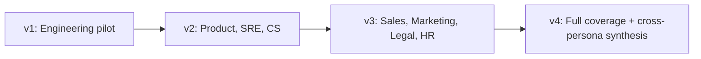

# AI Librarian — Decision-Support Roadmap

> Companion to [`phasing.md`](phasing.md) and
> [`personas.md`](personas.md) ·
> Authority: [ADR 0014](adr/0014-personas-first-class.md),
> [ADR 0015](adr/0015-persona-aware-retrieval-synthesis.md),
> [ADR 0016](adr/0016-persona-internal-autonomous-actions.md)

This roadmap orders the persona rollout and the
recommend → shadow → autonomous progression per persona's action
set. It runs in parallel with the foundational phases in
[`phasing.md`](phasing.md); each foundational phase has
Decision-Support deliverables that lift persona awareness from
schema to wiring to autonomous action over time.

## Versioning convention

| Version | Maps to |
|---|---|
| **v1** | Phases 0-4 in [`phasing.md`](phasing.md) — the foundational rollout |
| **v2** | First wave of additional personas (Phase 5+) |
| **v3** | Second wave |
| **v4** | Full persona coverage |

Each version is named, not date-bound; the gating between versions
is evidence accumulation per
[ADR 0016](adr/0016-persona-internal-autonomous-actions.md), not
calendar.

## Persona rollout order

| Version | Personas added | Persona-aware retrieval | Persona facets | Action set in Recommend | First Shadow / Autonomous |
|---|---|:---:|:---:|:---:|---|
| v1 (Phases 0-4) | Engineering | Engineering only | Engineering pages where source pool warrants | Phase 4 (Engineering) | None — Shadow target is v2 |
| v2 | + Product, SRE, Customer Success | All three | Yes | Yes (all three) | Engineering's first Autonomous (after v2 Shadow) |
| v3 | + Sales, Marketing, Legal, HR | All seven | Yes | Yes (all newly added) | Product, SRE, CS Shadow → Autonomous |
| v4 | + cross-persona synthesis (no new personas) | Cross-persona | Yes | All in scope | Sales, Marketing first Shadow |

## Per-persona progression details

The full action set per persona lives in each persona brief at
[`personas/<name>.md`](personas/). The progression below summarizes
*when* each persona's actions are expected to move through the
gates.

### Engineering (v1 pilot)

| Phase | Status |
|---|---|
| Phase 1 | Persona-aware retrieval wired (Engineering only) |
| Phase 2 | Engineering persona facets on warranted wiki pages; spot-check linter persona-aware |
| Phase 3 | Engineering source-type weights live (code, SQL, transcripts) |
| Phase 4 | Action set in Recommend mode; data accumulates |
| **v2** | First action (`ticket.classify` or `ticket.route`) promotes to Shadow once gate is met |
| **v3** | First action promotes to Autonomous once gate is met |

### Product (v2)

| Version | Status |
|---|---|
| v2 | Retrieval profile + synthesis style live; Recommend-mode action set |
| v2/v3 | `feedback.cluster`, `theme.tag`, `feature_request.dedupe` candidate for Shadow |
| v3+ | Shadow → Autonomous for non-draft actions only (drafts permanently Recommend) |

### SRE / Operations (v2)

| Version | Status |
|---|---|
| v2 | Retrieval + synthesis live; Recommend-mode action set |
| v2/v3 | `alert.classify`, `alert.attach_runbook`, `incident.link_similar` candidate for Shadow |
| v3+ | Shadow → Autonomous for the same set; remediation actions never autonomous |

### Customer Success (v2)

| Version | Status |
|---|---|
| v2 | Retrieval + synthesis live; Recommend-mode action set |
| v2/v3 | `account.flag_at_risk`, `account.flag_expansion_signal`, `account.tag_health_signal` candidate for Shadow |
| v3+ | Shadow → Autonomous; draft actions stay in Recommend |

### Sales (v2 / v3)

| Version | Status |
|---|---|
| v2/v3 | Retrieval + synthesis live; Recommend-mode action set |
| v3 | `account.tag_competitor_mention`, `account.flag_at_risk`, `winloss.cluster` candidate for Shadow |

### Marketing (v3)

| Version | Status |
|---|---|
| v3 | Retrieval + synthesis live; Recommend-mode action set |
| v3+ | All actions remain in Recommend through v3; Shadow promotion in v4 |

### Legal / Compliance (v3+)

| Version | Status |
|---|---|
| v3+ | Retrieval + synthesis live; Recommend-mode action set |
| v3+ | Conservative — most Legal actions retain Recommend mode indefinitely |

### HR / People (v3+)

| Version | Status |
|---|---|
| v3+ | Retrieval + synthesis live; Recommend-mode action set |
| v3+ | Anonymous-feedback actions remain in Recommend until a privacy review validates Shadow promotion |

## Per-persona surfaces

Each persona has its own surfaces (dashboards, digests, MCP tool
variants). These come online in the version when the persona is
first wired:

| Persona | Surfaces (when wired) |
|---|---|
| Engineering | Triage workspace, Ask-the-codebase search, MCP `persona=engineering` |
| Product | Signal workspace, Feature-request surface, MCP, weekly digest |
| SRE | Incident workspace, On-call hand-off view, Runbook health dashboard |
| Customer Success | Account workspace, At-risk surface, QBR Prep template |
| Sales | Account workspace (sales-shaped), Win/loss themes |
| Marketing | Voice-of-customer dashboard, monthly digest |
| Legal | Policy & Precedent workspace, RTBF/Records workspace |
| HR | HR Policy workspace, Feedback Themes (privacy-aware), Process Help |

## Per-persona evaluation

Each persona has its own golden set (size in the brief):

| Persona | Golden set size | First baseline |
|---|---|---|
| Engineering | 100 Q&A | Phase 2 |
| Product | 80 Q&A | v2 |
| SRE | 60 Q&A | v2 |
| Customer Success | 60 Q&A | v2 |
| Sales | 50 Q&A | v3 |
| Marketing | 50 Q&A | v3 |
| Legal | 40 Q&A | v3+ |
| HR | 40 Q&A | v3+ |

Per-persona evaluation is run quarterly once the persona is wired;
quality regressions trigger automatic regression to a more
cautious mode (per
[ADR 0016](adr/0016-persona-internal-autonomous-actions.md)).

## Cross-persona synthesis

Cross-persona synthesis (a Product question that genuinely depends
on Engineering signals; an SRE question that pulls Sales context;
etc.) is **deferred to v4**. v1-v3 use single-primary-persona
retrieval; the user re-queries with a different persona if needed.

The v4 design challenge is documented in
[ADR 0015](adr/0015-persona-aware-retrieval-synthesis.md) under
"Alternatives considered → Cross-persona blending in v1." The v4
design needs:

- A way to express "this is a cross-persona question" (explicit
  flag, or auto-detection)
- A blending strategy that doesn't muddle persona-specific quality
- Per-cross-persona evaluation pairs to validate the blend

## Persona auto-detection

Persona auto-detection from query intent is **deferred** with no
target version. It depends on accumulating ≥1,000 evaluated
queries per persona before a detector can be trained meaningfully.
Until then, explicit selection is the system's stance.

Captured in [`future-enhancements.md`](future-enhancements.md) as
the trigger for revisiting.

## Carve-outs are permanent

Two limits remain permanent across all versions:

- **No autonomous customer-facing actions** — drafts always go to
  internal queues
- **No AI-direct money / refund decisions** — recommend, analyze,
  draft remain available; binding decisions are human

These carve-outs do not appear on any version's roadmap because
they are structural, not phase-deferred. Any change requires a new
ADR with Legal sign-off
(per [ADR 0016](adr/0016-persona-internal-autonomous-actions.md)).

## Risks the roadmap inherits

- **Persona explosion** — quarterly persona review enforces the
  add-criteria from [ADR 0014](adr/0014-personas-first-class.md)
- **Promotion stall** — gate thresholds require real volume; the
  Engineering pilot is volume-rich by design (ticket triage)
- **Cross-persona drift** — deferred until v4; users are educated
  on single-primary-persona behavior
- **Carve-out drift** — structural, audited
  (`persona_action.mode_changed`); a new ADR is required to lift

## See also

- [`phasing.md`](phasing.md) — Foundational phases and the
  Decision-Support track that runs parallel
- [`personas.md`](personas.md) — Persona index
- [`personas/`](personas/) — Per-persona briefs
- [ADR 0014](adr/0014-personas-first-class.md) — Personas as a
  first-class organizing concept
- [ADR 0015](adr/0015-persona-aware-retrieval-synthesis.md) —
  Persona-aware retrieval and synthesis
- [ADR 0016](adr/0016-persona-internal-autonomous-actions.md) —
  Internal autonomous actions, scoped per persona
- [`future-enhancements.md`](future-enhancements.md) — Deferred
  capabilities (with permanent carve-outs noted)
