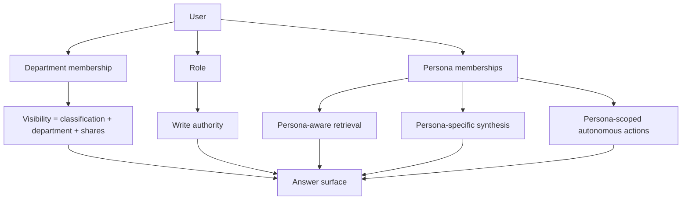

# AI Librarian — Personas

> Companion to [`architecture.md`](architecture.md) ·
> Authority: [ADR 0014](adr/0014-personas-first-class.md),
> [ADR 0015](adr/0015-persona-aware-retrieval-synthesis.md),
> [ADR 0016](adr/0016-persona-internal-autonomous-actions.md)

## Why this document exists

The AI Library has four organizing dimensions: **department**,
**role**, **classification**, and **persona**. The first three are
covered in the architecture and ADR set. This document is the
landing page for the fourth.

A **persona** is a defined work-context. It tunes:

- What the system retrieves (source-type weights, recency,
  authority signals)
- How the system synthesizes the answer (length, structure,
  citation density)
- Which autonomous internal actions the user / persona may invoke

A persona is **not** a visibility filter. Visibility stays governed
by classification + department + source shares. A user in the
Engineering persona who is *not* a member of the Finance department
still cannot read Finance's `Confidential` sources. Persona changes
*what the system does for you with what you can see*; it does not
change what you can see.

## The four-dimension model

| Dimension | Question | Authority |
|---|---|---|
| Department | What corpus do I own? | [ADR 0005](adr/0005-rls-with-entra.md) |
| Role | What can I do *to* sources in that corpus? | [ADR 0005](adr/0005-rls-with-entra.md) |
| Classification | What's safe for whom to see? | [ADR 0011](adr/0011-data-classification.md) |
| Persona | What kind of work am I doing right now? | [ADR 0014](adr/0014-personas-first-class.md) |

## v1 persona roster

The roster is the set of personas defined for the program. **Engineering
is the v1 pilot persona** (the only one fully wired in v1); the others
are defined now so the schema and roadmap have a known target, and so
v2+ work can wire them up without architectural change.

| Persona | Brief | First wiring |
|---|---|---|
| **Engineering** | [`personas/engineering.md`](personas/engineering.md) | **v1 (pilot)** |
| **Product** | [`personas/product.md`](personas/product.md) | v2 |
| **SRE / Operations** | [`personas/sre.md`](personas/sre.md) | v2 / v3 |
| **Sales** | [`personas/sales.md`](personas/sales.md) | v2 / v3 |
| **Marketing** | [`personas/marketing.md`](personas/marketing.md) | v3 |
| **Customer Success** | [`personas/customer-success.md`](personas/customer-success.md) | v2 / v3 |
| **Legal / Compliance** | [`personas/legal-compliance.md`](personas/legal-compliance.md) | v3+ |
| **HR / People** | [`personas/hr-people.md`](personas/hr-people.md) | v3+ |

The phased rollout per persona — including the
recommend → shadow → autonomous progression for each persona's
action set — lives in
[`decision-support-roadmap.md`](decision-support-roadmap.md).

## Persona membership

A user may belong to **multiple personas simultaneously**. Each
session designates a *primary persona* that drives retrieval and
synthesis (per
[ADR 0015](adr/0015-persona-aware-retrieval-synthesis.md)).

Memberships may be:

- **Department-scoped**: "Engineering persona, scoped to Backend"
  is different from "Engineering persona, scoped to Frontend"
- **Time-bounded**: a short-term assignment to the
  `Incident-Response` persona (when one is added) expires after
  the incident
- **Default-granted**: a department's Librarian gets the
  department's primary persona by default

Memberships are managed by:

- **Admin** — system-wide
- **Department Librarian** — within their department's scope (per
  the [ADR 0005](adr/0005-rls-with-entra.md) amendment)

Every grant and revocation is audited
(`persona_membership.granted`, `persona_membership.revoked`) per
the [ADR 0010](adr/0010-audit-ledger.md) amendment.

## How a persona shapes a query

```mermaid
flowchart LR
    q[Query + persona] --> auth[AuthZ + session vars]
    auth --> hybrid["Hybrid search (vector + lexical)"]
    hybrid --> rls["RLS filter (authorized set)"]
    rls --> rerank["Rerank<br/>persona retrieval profile applied"]
    rerank --> ctx["Context assembly<br/>persona retrieval profile applied"]
    ctx --> gw["LLM Gateway<br/>persona synthesis style applied"]
    gw --> resp[Response with persona-shaped answer]
    resp --> audit["Audit (with persona context)"]
```

The structural safety property: **persona-aware ranking runs
*after* RLS filtering**. A persona cannot widen the authorized
result set — RLS already narrowed it.

## Recommend → Shadow → Autonomous

Every autonomous action a persona may take progresses through three
modes:

| Mode | Behavior |
|---|---|
| **Recommend** | The system surfaces a suggestion; a human chooses |
| **Shadow** | The system simulates the decision and logs what it *would have* done; no real-world effect |
| **Autonomous** | The system effects the action; humans review samples after the fact |

A new action starts in Recommend. Promotion to Shadow requires
≥30 days, ≥200 evaluated recommendations, and ≥85% agreement-with-
human. Promotion to Autonomous requires ≥30 days in Shadow,
≥500 shadow decisions, ≥90% agreement, a tested reversal path, and
the Sponsoring Persona Owner's sign-off. Per
[ADR 0016](adr/0016-persona-internal-autonomous-actions.md).

A persona's full action set lives in its brief.

## Permanent carve-outs

Two limits are structural, not phase-deferred:

- **No autonomous customer-facing actions.** No persona may
  autonomously send a message to a customer or change a customer-
  facing system state. Drafts intended for customers are placed
  in an internal queue for explicit human review.
- **No AI-direct money / refund decisions.** No persona may
  autonomously approve, deny, or execute a refund, credit, or
  charge. The AI may analyze, recommend, draft, and surface
  signals on money/refund work; a human always makes the binding
  call.

These carve-outs are enforced architecturally per
[ADR 0016](adr/0016-persona-internal-autonomous-actions.md). Any
future change requires a new ADR with Legal sign-off. They are
**not** capabilities that emerge over time.

## Customer is not a persona

The customer is a **signal source**, not a system user. Customer
interactions (tickets, conversations, transcripts, surveys, in-app
feedback) feed the corpus through ingestion. Customers do not
query the AI Library. Every persona's autonomous-action set is
constrained by the carve-outs above so that no autonomous action
ever reaches a customer.

## Adding a new persona

A new persona is added when **all** of the following are true:

1. There is a defined work-context not covered by an existing persona
2. The retrieval, synthesis, or autonomous-action shape differs
   materially from existing personas
3. There is a sponsoring department willing to pilot it
4. The persona has a defined `default_action_set` — even if empty —
   so the autonomous-action surface is explicit from day one

Adding a persona is an Architect-approved change documented in a
new `docs/personas/<name>.md` brief and an entry in this index.
It does *not* require an ADR amendment unless a new *category*
of action (e.g., scheduling, notifying-internal) is being
introduced. Personas are intended to be a *living roster* that
grows with the organization, not a fixed taxonomy.

## See also

- [ADR 0014](adr/0014-personas-first-class.md) — Personas as a
  first-class organizing concept
- [ADR 0015](adr/0015-persona-aware-retrieval-synthesis.md) —
  Persona-aware retrieval and synthesis
- [ADR 0016](adr/0016-persona-internal-autonomous-actions.md) —
  Internal autonomous actions, scoped per persona
- [`decision-support-roadmap.md`](decision-support-roadmap.md) —
  Phased rollout per persona
- [`glossary.md`](glossary.md) — Definitions of persona-related
  terms
